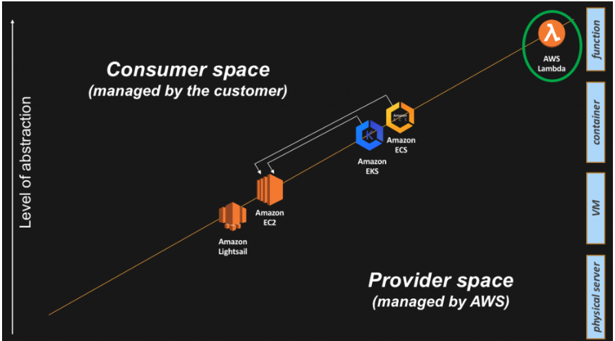

# Cloud Security Principles
https://aws.amazon.com/blogs/architecture/compute-abstractions-on-aws-a-visual-story/

## Explain the levels of abstraction in AWS to someone without a technical background.
The three levvels are Infrastructure, Platform, and Application. If we think of the layers like a city. Infrastructure would be the foundatiom or the ground level. Includes things like servers and networking equipments. Next is the Platform layyer which is like the city's transportation system. Includes OSs and databases. Mangements the movement of data. Lastly the Application layer which are the buildings in our city. Things like webistes and apps. Where we get to interact with the city and conduct daily activies 

## What are the control plane and data plane responsible for in container abstraction?
> A containers *control plane* that is responsible for exposing the API and interfaces to define, deploy, and lifecycle containers. This is also sometimes referred to as the container orchestration layer.
> A containers *data plane* that is responsible for providing capacity (as in CPU/Memory/Network/Storage) so that those containers can actually run and connect to a network. From a practical perspective this is typically a Linux host or less often a Windows host where the containers get started and wired to the network.

## Where does AWS Lambda fall in the layers of abstraction and what makes it so special?
> What makes Lambda so special is its event-driven model. Not only can you invoke Lambda directly (for example, via the Amazon API Gateway), but you can trigger a Lambda function upon an event in another AWS service (for example, an upload to Amazon S3 or a change in an Amazon DynamoDB table).
